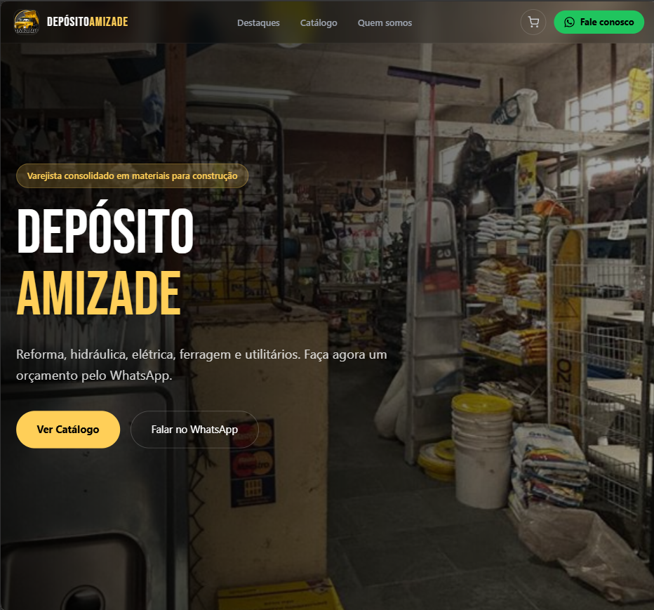
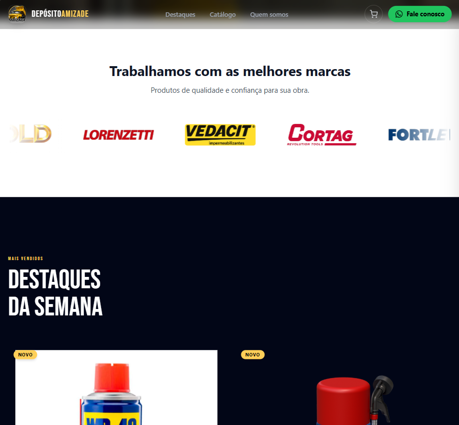
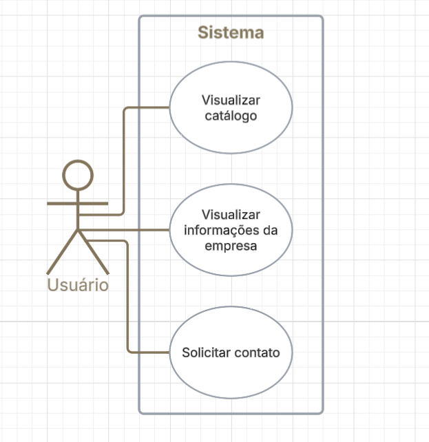

# Deposito-Amizade

Sistema web responsivo para otimização de processo onde vendedores perdiam tempo ao responder clientes sobre estoque de produtos.

O projeto foi construído aplicando conceitos de Engenharia de Software, incluindo levantamento de requisitos, documentação de casos de uso e arquitetura escalável.
---

## Demonstração

### Área do Cliente

### Documentação

